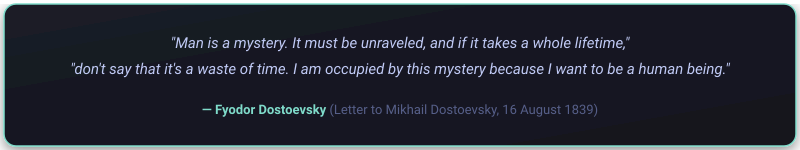
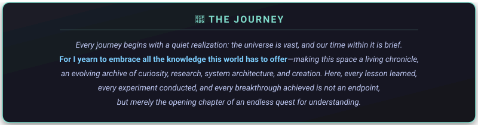

# 🌌 @k4isellyn

### **Cybersecurity Researcher • Backend Systems Architect • AI/ML Engineer**

 

 

---

## 💻 Tech Stack & Capabilities

### 🔐 Cybersecurity & Defense

 

### ⚙️ Backend Systems & Infrastructure

 

### 🌐 Mobile & Modern Web

 

### 🤖 AI & Data Science

---

---

<svg xmlns="http://www.w3.org/2000/svg" width="650" height="90" viewBox="0 0 650 90">
  <defs>
    <linearGradient id="pillarsBg" x1="0%" y1="0%" x2="100%" y2="100%">
      <stop offset="0%" stop-color="#1a1b26"/>
      <stop offset="100%" stop-color="#16161e"/>
    </linearGradient>
    <linearGradient id="lineGrad" x1="0%" y1="0%" x2="100%" y2="0%">
      <stop offset="0%" stop-color="#1a1b26"/>
      <stop offset="30%" stop-color="#7fdbca"/>
      <stop offset="50%" stop-color="#7aa2f7"/>
      <stop offset="70%" stop-color="#bb9af7"/>
      <stop offset="100%" stop-color="#1a1b26"/>
    </linearGradient>
    <filter id="pillarsGlow" x="-10%" y="-10%" width="120%" height="120%">
      <feDropShadow dx="0" dy="4" stdDeviation="6" flood-color="#000000" flood-opacity="0.4"/>
    </filter>
  </defs>
  
  <rect x="4" y="4" width="642" height="82" rx="12" fill="url(#pillarsBg)" stroke="#7fdbca" stroke-width="1.5" stroke-dasharray="6,4" filter="url(#pillarsGlow)"/>
  
  <text x="325" y="42" fill="#7fdbca" font-family="-apple-system, BlinkMacSystemFont, 'Segoe UI', Roboto, sans-serif" font-size="16" font-weight="700" letter-spacing="3" text-anchor="middle">
    🏛️ THE PILLARS OF STELLA
  </text>

  <!-- Elegant gradient accent line underneath -->
  <line x1="160" y1="58" x2="490" y2="58" stroke="url(#lineGrad)" stroke-width="1.5" stroke-linecap="round"/>
</svg>

 

*P.S. If fate grants me love again, may I cherish what I once took for granted.*

